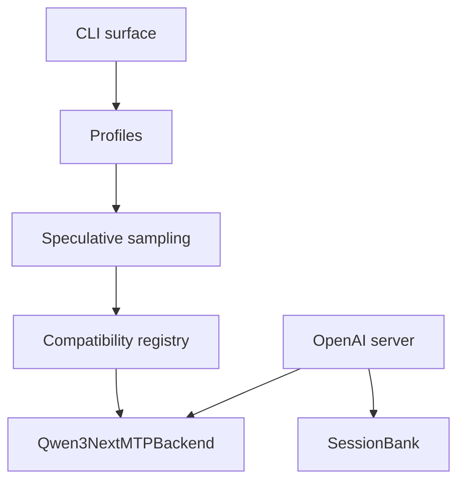

# Architecture

MTPLX is organized around a small public CLI, profile selection, a model compatibility registry, and a backend that owns architecture-specific MTP details.

The speculative sampler should remain backend-agnostic. Backends provide proposal and verification mechanics for a specific model family. The backend node above stands for the whole family set — Qwen3-Next (the promoted default), DeepSeek MTP, DeepSeek-V4, GLM, Hy-V3, MiMo, Nemotron-H, Step3.5, and Gemma4, plus the Laguna AR-only route.
