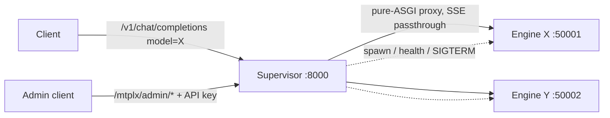
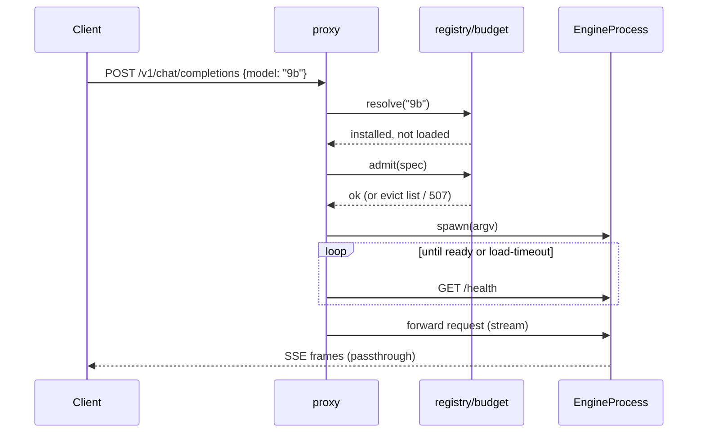

# Design — Model Supervisor

Status: approved for implementation 2026-09-22 (unattended run; decisions recorded in the
Decision log below). Inputs: `FEATURE_CONTEXT.md`, `../../explore/EXPLORE_model-supervisor.md`.

## Shape

One new package, `mtplx/supervisor/`, and one new command, `mtplx supervise`. The supervisor
is a separate process that owns N engine children. Each engine child is today's daemon,
launched with the public `mtplx serve` argv on `127.0.0.1:<ephemeral>` with `--no-auth`, so
every existing flag, profile and pack rule applies unchanged. The supervisor listens on the
public host:port, authenticates, and streams requests through to the engine chosen by the
request's `model` field. No engine code changes.

## Modules

| Module | File | Responsibility | Depends on |
|---|---|---|---|
| registry | `mtplx/supervisor/registry.py` | `EngineSpec` (model id, path, size estimate), `EngineRecord` state machine (`installed -> loading -> ready -> draining -> stopped -> failed`), LRU order, idle TTL, in-flight pin counts | none |
| budget | `mtplx/supervisor/budget.py` | memory budget = `usable_engine_bytes(total_ram)` minus reserve; `estimate_resident_bytes(pack)` from `model_catalog` (`peak_memory_gib`) with a weights-size fallback; `admit(spec) -> Admission(ok, reason, evictable)` | registry, `mtplx.memory_plan`, `mtplx.model_catalog` |
| process | `mtplx/supervisor/process.py` | `EngineProcess`: build argv, spawn (`subprocess.Popen`), health probe (`/health` `ok: true`), liveness verdict (busy vs dead per `DaemonLivenessPolicy.swift`), terminate escalation (SIGTERM, SIGINT, SIGKILL), `RestartPolicy(max_attempts=3, initial_delay=1s, max_delay=30s, crash_window=120s)`, OOM classification (exit code or stderr match) that suppresses restart | none |
| proxy | `mtplx/supervisor/proxy.py` | pure-ASGI app: resolve `model` -> engine (JSON body peek for POST, query for GET), JIT load with a hold up to `--load-timeout-s`, forward request with `httpx.AsyncClient` streaming (no body buffering), pin/unpin in-flight, map engine-down to 503 with `Retry-After` | registry, budget, process |
| admin | `mtplx/supervisor/admin.py` | `/mtplx/admin/models` (GET), `/mtplx/admin/load` `/unload` `/restart` (POST), `/mtplx/admin/health`; front-door `/health` and `/v1/models` synthesized from engine health; API-key gate reusing `_request_is_authorized` semantics (header `Authorization: Bearer` or `x-api-key`) | registry, process |
| supervisor | `mtplx/supervisor/service.py` | `Supervisor` object: wires the above, background loop (health sweep 2s, idle sweep 30s, restart scheduling with generation counter), graceful shutdown (drain then terminate all) | all |
| cli | `mtplx/cli.py`, `mtplx/commands/public.py` | `mtplx supervise --models a,b --default a --host --port --api-key-file --memory-budget --idle-ttl-s --load-timeout-s --evict-to-fit --strict-model --insecure-lan`; forwards the same engine flags `serve` accepts | service |

## Key behaviors

1. **Routing.** `model` matches a loaded engine: route. Matches an installed pack: JIT load
   (hold the request until `ready` or timeout, then 503). Unknown or missing: route to the
   default engine and add header `x-mtplx-routed-model: <default>`; with `--strict-model`
   return 404 `{"error": {"code": "model_not_found"}}`.
2. **Budget and eviction.** Before spawning: `admit(spec)`. If it does not fit and
   `--evict-to-fit` is set, unload idle engines in LRU order (never a pinned one) until it
   fits; otherwise 507 with `{"error": {"code": "insufficient_memory", "needed_bytes",
   "available_bytes", "would_free": [...]}}`.
3. **Idle unload.** An engine with zero pins whose last request is older than
   `--idle-ttl-s` (default 1800, `0` disables) is drained and terminated. The default engine
   is exempt unless `--unload-default`.
4. **Liveness.** Every 2 s: process alive? port accepting? `/health` ok? Verdict per the
   Swift policy: alive + accepting is `busy`, never reaped on a probe timeout alone; reap only
   on process gone, port closed, or silence longer than `--unresponsive-grace-s` (default 90).
5. **Restart.** On reap: pins get 503 once the socket closes; restart with backoff inside the
   policy; more than 3 crashes in 120 s marks the engine `failed` (admin restart clears it).
   An OOM-classified death is `failed` immediately with reason `out_of_memory`; no auto
   restart.
6. **Auth.** Admin routes always require the key. Inference routes follow today's rule: no
   key needed on localhost binds, key required otherwise. `--insecure-lan` lifts the
   requirement for inference only, prints a warning at start and in `/health`.
7. **Engine argv.** `[sys.executable, "-m", "mtplx.cli", "serve", "--model", path, "--host",
   "127.0.0.1", "--port", str(port), "--no-auth", "--yes", *forwarded_engine_flags]`. The
   supervisor never puts a key on any argv.
8. **Shutdown.** SIGTERM to the supervisor: stop accepting, wait up to `--drain-s` (15) for
   pins, terminate engines with the escalation ladder, exit 0.

## Sequence: JIT load

## Compatibility

- `mtplx serve` is untouched. The Swift app keeps launching `serve`; a later change can point
  it at `supervise`.
- `/health` from the supervisor carries `ok`, `model` (default engine), `startup.pid`
  (supervisor pid), `startup.launch_id`, plus `supervisor: {engines: [...]}` so
  `daemon_client.fetch_daemon_health` and `mtplx stop` keep working.
- `/v1/models` lists every loaded and installed pack; loaded ones carry `"loaded": true`.

## Test plan

- registry/budget: pure unit tests (state transitions, LRU order, pin blocks eviction,
  admission math with fake sizes and a fake total-RAM value).
- process: a fake engine script (`tests/fixtures/fake_engine.py`, tiny http server that
  answers `/health` and can be told to hang, exit, or print an OOM line) exercising spawn,
  probe, busy-vs-dead verdicts, escalation, restart policy and OOM classification.
- proxy/admin: in-process fake engines (`TestClient`-style ASGI apps served by uvicorn on
  ephemeral ports in threads) behind the real supervisor app; tests for routing, fallback
  header, strict 404, JIT hold, 507 shape, SSE passthrough byte-for-byte, admin auth 401,
  load/unload/restart, `/v1/models` merge.
- cli: argparse and forwarding tests in `tests/test_public_cli.py` style.
- No test loads a real model.

## Decision log

| # | Decision | Why |
|---|---|---|
| D1 | Separate process, not in-process multi-runtime | no unload path exists for the chat runtime; `ModelWorkScheduler` is single-owner; a process boundary is also what makes crash recovery possible |
| D2 | Spawn via the public `mtplx serve` argv rather than `python -m mtplx.server.openai` | reuses every flag, profile and onboarding rule; one extra wrapper process per engine is negligible |
| D3 | Unknown `model` falls back to the default with a header (strict mode opt-in) | today `model` is ignored entirely; hard-failing would break every existing client |
| D4 | httpx for the proxy client | already imported by `mtplx/server/openai.py`; add `httpx>=0.27` to dependencies explicitly |
| D5 | Admission uses catalog `peak_memory_gib` when known, else 1.15 x weights size on disk | measured figures where they exist, honest estimate elsewhere |
| D6 | OOM death never auto-restarts | mirrors `DaemonSupervisor.swift:254`; restarting into the same OOM spins |
