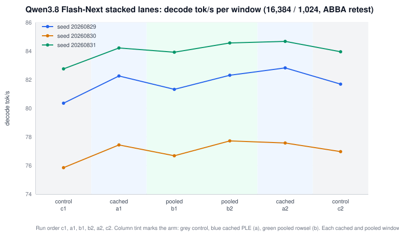

# Two stacked decode lanes for Qwen3.8 Flash-Next

This report covers two lanes from an external optimization pass that stack on top
of the Qwen3.8 Flash-Next stack. Both lanes keep the output identical to the stock path. Both lanes change
only the decode timing.

Terms:

- PLE: per-layer embedding, fed from an n-gram sidecar table.
- QSA: Qwen Sparse Attention.
- M4: the fixed four-row speculative verify width.
- lane: the unit an operator turns off with one switch.
- tok/s: tokens per second.

The cell for every number in this report is the canonical served cell: a 16,384
token templated prompt, 1,024 output tokens, temperature 1, top-p 0.95, top-k 20,
reasoning effort `xhigh`, native MTP depth 3, seeds 20260829 / 20260830 /
20260831, a pre-warmed n-gram table, cross-request prefix restore off (each seed
prefills cold), a 40 degree Celsius thermal hold, and fans at maximum.

---

## 1. What each lane changes

### 1.1 Cached async PLE (lane `ple_cached_aux`)

The stock fixed-M4 route builds the auxiliary PLE embedding plane inside the
compiled verifier. This lane moves that work out of the compiled graph. A native
provider hashes the fixed 64 M4 n-gram row IDs and reads the cold rows once. The
provider binds the existing stock row cache; it does not add a second cache. The
lane then produces the auxiliary embedding plane with `mx.async_eval`, so the PLE
rows are produced while the compiled verifier replays. The compiled graph
arithmetic does not change, so the output is identical to the stock path.

The lane keeps the stock owner-side cache and the stock warm handoff. It holds at
most two pending native tickets. It fails the model load if the native
installation fails; it does not run as stock after a failure.

- Env key: `MTPLX_FABLE_PLE_CACHED_AUX`. Default on for a served Flash-Next pack.
- Off switch: `MTPLX_FABLE_PLE_CACHED_AUX=0`, or
  `--disable-optimization ple_cached_aux`, or `MTPLX_FABLE_DISABLE=ple_cached_aux`.
- Requirement: the native extension `native_extensions/ple_cpu_rows`. Build it
  with `scripts/fable/setup_over100_venv.sh`. When the extension is not built,
  the lane declines with a printed reason and the server serves the stock path.
- Files: `mtplx/ple_cached_aux.py`, `mtplx/ple_cached_row_handoff.py`,
  `native_extensions/ple_cpu_rows/`, the loader in `mtplx/native/__init__.py`.
- Install verdict: `[fable] ple_cached_aux ...` on the server log, and a
  `/health` engagement report under `engagement_reports.ple_cached_aux`.

### 1.2 Fixed-M4 pooled-key rowsel (lane `qsa_pooled_rowsel`)

The twelve real QSA indexers prepare pooled keys once per decode call. This lane
replaces that preparation with a construction-bound rowsel method. The method
binds the existing pool-keys Metal kernel metadata once per indexer. It shares
one `inv_freq` object across the twelve indexers. It removes the per-call pooled
key setup from the decode path. It uses stock MLX; it needs no native extension.

The lane is exact by construction. The install checks the 48-layer QSA layout, the
per-indexer geometry, the RMS-norm epsilon, the RoPE scale, the shared `inv_freq`
object identity, and the rope and bank op-diet items. The install reports bank
mode `rowsel` with no weight copies. A contract failure fails the model load.

The method derives the number of new pooled blocks from the write width, not from
an assumed single block. So the method stays correct if a width-parameterized
verify writes 5 or 6 rows in one step
(`MTPLX_QWEN4_FIXED_VERIFY_ROWS`, which lands separately): four rows fill one
pooled block, and five to eight rows fill two.

- Env key: `MTPLX_FABLE_QSA_POOLED_ROWSEL`. Default on for a served Flash-Next
  pack.
- Off switch: `MTPLX_FABLE_QSA_POOLED_ROWSEL=0`, or
  `--disable-optimization qsa_pooled_rowsel`, or
  `MTPLX_FABLE_DISABLE=qsa_pooled_rowsel`.
- Files: `mtplx/qsa_pooled_rowsel.py`.
- Install verdict: `[fable] qsa_pooled_rowsel ...` on the server log, and a
  `/health` engagement report under `engagement_reports.qsa_pooled_rowsel`.

### 1.3 Arming

The server arms both lanes for a served Flash-Next pack, the same way it arms the
retained stack: a `setdefault` behind the served-config check. An operator export
beats the default. The two lanes stay out of the retained 44-key stack and out of
the full-stack self-check, so the PR-391 battery counts and the committed flag
files do not move. The two lanes share the retained stack's off switches only:
`--disable-optimization`, `MTPLX_FABLE_DISABLE`, and `all`.

`GET /health` reports the resolved state of both lanes under
`aux_lane_defaults`, beside the retained stack's `fable_defaults` block.

---

## 2. The 16,384 / 1,024 ABBA retest

The retest ran six guarded windows in the order control, cached, pooled, pooled,
cached, control (c1, a1, b1, b2, a2, c2). The bracketing controls cancel the
linear drift across the run. Every window ran the three seeds cold. The engine is
MTPLX 2.10.2 on MLX 0.32.2, served from the branch, with the 100 GiB memory cap.



### 2.1 Decode tok/s per window, per seed

| Window | Arm | 20260829 | 20260830 | 20260831 | Mean |
| --- | --- | ---: | ---: | ---: | ---: |
| c1 | control | 80.357 | 75.851 | 82.757 | 79.655 |
| a1 | cached | 82.261 | 77.439 | 84.219 | 81.306 |
| b1 | pooled | 81.325 | 76.683 | 83.920 | 80.642 |
| b2 | pooled | 82.310 | 77.720 | 84.569 | 81.533 |
| a2 | cached | 82.825 | 77.574 | 84.680 | 81.693 |
| c2 | control | 81.691 | 76.973 | 83.953 | 80.872 |

Prefill stays flat across the arms (control 1,316.0, cached 1,317.0, pooled
1,316.3 tok/s mean). Peak memory stays flat (92.62 GB mean). Both arms produce
output that is byte-identical to control: the reasoning digest and the text
digest match control on all three seeds, for both cached windows and both pooled
windows.

### 2.2 Paired deltas

The window-mean delta compares the mean of an arm's two windows against the mean
of the two bracketing controls.

| Arm | Decode mean tok/s | vs control 80.264 | 17,408 (history) |
| --- | ---: | ---: | ---: |
| control (c1, c2) | 80.264 | n/a | n/a |
| cached async PLE (a1, a2) | 81.500 | +1.236 (+1.54%) | +1.20% |
| fixed-M4 pooled (b1, b2) | 81.088 | +0.824 (+1.03%) | +0.77% |

The per-seed delta pairs the two control windows against the two candidate
windows at the same seed.

| Seed | control | cached | Δ cached | pooled | Δ pooled | control window spread |
| --- | ---: | ---: | ---: | ---: | ---: | ---: |
| 20260829 | 81.024 | 82.543 | +1.87% | 81.818 | +0.98% | 1.65% |
| 20260830 | 76.412 | 77.506 | +1.43% | 77.201 | +1.03% | 1.47% |
| 20260831 | 83.355 | 84.449 | +1.31% | 84.245 | +1.07% | 1.43% |
| mean | n/a | n/a | +1.54% | n/a | +1.03% | 1.52% |

### 2.3 Noise band and verdicts

The seed-to-seed swing is large, because it follows the completion length; the
same-seed pairing cancels it. The load-bearing noise is the window-to-window
spread: the two control windows differ by about 1.52%. A claim near 1% therefore
needs the separation test, not the raw magnitude.

Separation test: does every candidate window beat every control window?

- Cached async PLE: yes, with no overlap. At every seed the slower cached window
  is above the faster control window, and the cached window-mean minimum (81.306)
  is above the control window-mean maximum (80.872).
- Fixed-M4 pooled: no. The slower pooled window falls below the faster control
  window at all three seeds, and at the window-mean level (80.642 below 80.872).

Verdicts:

- **Cached async PLE reproduces.** The gain is small (about +1.5% decode) and
  near the window-to-window noise band, but it separates from noise: every cached
  measurement beats its matched control, per seed and per window-mean. The output
  is byte-identical and prefill and peak are flat.
- **Fixed-M4 pooled does not separate from noise at this shape.** The direction
  is positive and stable (+0.98% to +1.07% per seed, echoing the +0.77% at 17,408), but
  the effect overlaps the window-to-window drift with two windows per arm. The
  output is byte-identical.

---

## 3. Original numbers at 17,408 tokens (history)

The lanes were first measured at a different shape: 17,408 templated prompt tokens
(1,024 Python input plus 16,384 prefill) and 1,024 output tokens. That shape is
not the canonical cell, which is why the section 2 retest exists. The original
numbers are kept here as history.

| Lane | candidate | control | Delta |
| --- | ---: | ---: | ---: |
| Cached async PLE (best, A2) | 80.8518 tok/s | 79.8925 tok/s | +1.20% decode, -0.71% wall |
| Fixed-M4 pooled rowsel | 80.4197 tok/s | 79.8085 tok/s | +0.77% decode, -0.39% wall |

---

## 4. Same-build served pair

Two guarded windows ran on one build of this worktree, on the canonical cell.
The `stack-both` window serves the defaults, so the server arms both lanes; the
`control` window serves the same build with both lanes off
(`MTPLX_FABLE_PLE_CACHED_AUX=0`, `MTPLX_FABLE_QSA_POOLED_ROWSEL=0`). The server
log confirms engagement on the `stack-both` window: `[fable] ple_cached_aux`
installs `variant=async_aux`, and `[fable] qsa_pooled_rowsel` installs 12 rowsel
bindings with one shared `inv_freq` object.

| Seed | Arm | prefill tok/s | decode tok/s | peak GB | wall s | TTFT s | gen (finish) | reasoning sha | text sha |
| --- | --- | ---: | ---: | ---: | ---: | ---: | --- | --- | --- |
| 20260829 | stack-both | 1,284.2 | 82.952 | 89.20 | 25.32 | 12.96 | 1024 (length) | cfc57ad86ebd | e3b0c44298fc |
| 20260829 | control | 1,287.3 | 81.232 | 89.20 | 25.55 | 12.93 | 1024 (length) | cfc57ad86ebd | e3b0c44298fc |
| 20260830 | stack-both | 1,350.4 | 77.530 | 93.50 | 20.19 | 12.30 | 610 (stop) | a69cd27623b6 | cf5e14d1a99c |
| 20260830 | control | 1,353.2 | 76.571 | 93.50 | 20.26 | 12.27 | 610 (stop) | a69cd27623b6 | cf5e14d1a99c |
| 20260831 | stack-both | 1,351.5 | 84.761 | 95.17 | 24.02 | 12.32 | 990 (stop) | 0b28bbfa9fad | 2baf608e1946 |
| 20260831 | control | 1,353.4 | 83.602 | 95.17 | 24.17 | 12.30 | 990 (stop) | 0b28bbfa9fad | 2baf608e1946 |
| mean | stack-both | 1,328.7 | 81.747 | 92.62 | 23.17 | 12.52 | n/a | n/a | n/a |
| mean | control | 1,331.3 | 80.468 | 92.62 | 23.33 | 12.50 | n/a | n/a | n/a |

The two lanes together add **+1.279 decode tok/s, +1.59%** over the same build
with both lanes off (per seed +2.12% / +1.25% / +1.39%). Prefill and peak memory
are flat, and TTFT is flat. The output is byte-identical: the reasoning digest
and the text digest match between the two arms on all three seeds. This
same-build pair is the number this pull request cites.


---

## 5. Changes that did not work

Other candidates were measured on the same family. Every row below is measured and
rejected. The code of these rows is not in this pull request. The numbers are
from the lane inventory built on 2026-09-06.

| Lane | Measured effect at 17,408 (or noted shape) | Reason it is not here |
| --- | --- | --- |
| Native sidecar sync raw | 73.03 tok/s (about -8.5%) | The uncached predecessor of the cached lane; the synchronous native read sits on the critical path. |
| Native sidecar async raw | 78.34 tok/s (about -1.9%) | The uncached predecessor; the cached lane supersedes it. |
| GDN conv/norm fused rows | -0.53 tok/s, +0.12 s wall | The component win did not survive the full model. |
| Empty finalization | -0.33% tok/s, +0.15% wall | Near flat, and it needs a custom profiler MLX build. |
| Native compiled-graph replay slot plan | -0.07% tok/s, +0.38% wall | An MLX-core change that measured flat to slightly slower. |
| Command-buffer timing extension | -0.18% tok/s | Measurement instrument, not a speedup; it costs to enable. |
| GPU-stream PLE transport | -1.88% tok/s, +0.86% wall | Replacing the CPU queue transport with a GPU-stream factory did not help. |
| Deferred CPU PLE serving | -1.93% tok/s, +1.02% wall | The schedule trades old overlap for new overlap and shows no gain. |
| Queued sampled-D3 selector | -4.49% tok/s, +2.52% wall | The queued GPU-to-CPU-to-GPU boundary adds draft cost. |
| MTP depth 4 | 55.77 tok/s (about -30%) | Closed by the maintainer; the deeper draft costs more than it accepts. |
| Draft temperature 0.85 | about 77.76 tok/s against 79.79 | Closed by the maintainer; the benchmark contract is temperature 1. |

---

## 6. How to run and how to disable

Build the venv and both native extensions:

```bash
scripts/fable/setup_over100_venv.sh
```

Serve the pack. The server arms both lanes by default:

```bash
mtplx serve \
  --model ~/.mtplx/models/Youssofal--Qwen3.8-Flash-Next-MTPLX-Optimized-Speed \
  --model-id mtplx-flash-next-optimized-speed
```

Read `GET /health` and check the `aux_lane_defaults` block. Confirm that the
`[fable] ple_cached_aux` and `[fable] qsa_pooled_rowsel` verdicts name both lanes.

Turn one lane off:

```bash
mtplx serve --disable-optimization ple_cached_aux --model ...
MTPLX_FABLE_QSA_POOLED_ROWSEL=0 mtplx serve --model ...
```

Turn both stacked lanes off:

```bash
mtplx serve --disable-optimization ple_cached_aux,qsa_pooled_rowsel --model ...
```
