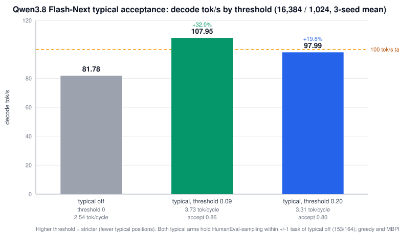

# Typical acceptance for Qwen3.8 Flash-Next

Typical acceptance is an opt-in decode lane. It raises the number of tokens
committed per verify cycle. It is OFF by default. It is NOT distribution-exact.

Terms used in this document:

- MTP: multi-token prediction. The model drafts several tokens, then verifies
  them in one cycle.
- Verify cycle: one target forward pass that checks a block of draft tokens.
- tokens/cycle: committed tokens divided by verify cycles. Higher is faster.
- tok/s: decode tokens per second.
- delta, eps, H: the parameters of the acceptance floor `min(eps, delta*exp(-H))`,
  where H is the entropy of the target row.
- exact rule: the distribution-exact speculative-sampling law that the lane
  replaces when it is on.

---

## 1. Chart

The chart shows decode tok/s for the three arms: exact (lane off), threshold 0.09
and threshold 0.20. The dashed line marks the 100 tok/s target. Threshold 0.09
clears it; threshold 0.20 is a stricter setting that sits between exact and 0.09.

---

## 2. What it does

The exact rule verifies each draft token with a rejection coin. It accepts a
draft token `x` with probability `min(1, p(x)/q(x))`, where `p` is the target row
and `q` is the draft row. If it rejects a token, it resamples that position from
the residual `(p - q)+` and stops the block there. This law reproduces the target
distribution exactly, one token at a time.

Typical acceptance changes the accept test. It accepts a draft token when the
token is "typical" under the target row:

    p(x) > min(eps, delta * exp(-H(p)))

It accepts the longest run of typical positions in the draft block. At the first
position that is not typical, it resamples that position from the target row `p`
itself (not from the residual), and stops the block there. The per-position test
uses no coin; it is deterministic.

The floor adapts to the target's entropy H. When the target is confident (low
H), the floor is high, so only a high-probability token is typical. When the
target is uncertain (high H), the floor is low, so more tokens are typical. This
accepts more draft tokens per cycle than the exact coin does.

This is why the lane is faster and why it is not exact. It commits more tokens
per cycle, but the committed stream no longer matches the target distribution. It
is gated on task quality instead (Section 4).

At temperature 0 the primary token is the argmax. The argmax is always typical,
so at temperature 0 the lane changes nothing. It engages only at temperature > 0.

### Reference

Cai, Li, Geng, Peng, Lee, Chen, Dao. "Medusa: Simple LLM Inference Acceleration
Framework with Multiple Decoding Heads." 2024. arXiv:2401.10774, Section 2.3.1
"Typical Acceptance". The acceptance criterion there is
`p_original(x) > min(epsilon, delta * exp(-H(p_original)))`. Medusa adapts the
typicality idea from Hewitt, Manning, Liang. "Truncation Sampling as Language
Model Desmoothing." 2022. arXiv:2210.15191.

---

## 3. The knob

One operator knob controls the lane: `--typical-threshold` (environment
`MTPLX_FABLE_TYPICAL_THRESHOLD`).

- The threshold maps to delta.
- Higher is stricter. A higher floor makes fewer positions typical, so fewer
  draft tokens are accepted and the arm sits closer to the exact rule.
- Unset or 0 turns the lane off. The exact rule then runs unchanged.
- As the threshold grows large, the floor exceeds every target-row mass, so every
  position is resampled from the target row and each cycle commits one exact
  token. That is the exact rule's one-token-per-cycle worst case.

`eps` is an advanced cap (`MTPLX_FABLE_TYPICAL_EPS`, default 1.0). The floor is
`min(eps, delta*exp(-H))`. With eps = 1.0 the cap never binds for any delta <= 1,
so eps is inert at the operating points measured here. Lower eps only to set a
hard ceiling on the floor independent of entropy.

`GET /health` reports the resolved state under `typical_acceptance`
(`enabled`, `threshold`, `eps`, `distribution_exact`). Each active request prints
a `[typical-accept] NOT distribution-exact; ...` line to the server log.

The lane is never on by default. It is not in the served Flash-Next default
stack. A served pack does not arm it; only the flag or the environment key does.

---

## 4. Results

These numbers were measured on the #391 stack: the v2.11 release, the Qwen3.8
Flash-Next aux lanes (#475), and this typical-acceptance lane on top, at MTPLX
2.10 on MLX 0.32.2. This commit re-parents the lane onto upstream main (v2.11.2).
The acceptance law and the dial are unchanged, and the exact law is byte-identical
when the flag is unset, but the absolute tok/s and the eval scores must be re-run
on upstream main before they are cited for #478. The upstream-main re-measurement
repeats the perf triple (exact, threshold 0.09, threshold 0.20) at the canonical
cell below and the full code-eval battery, pairing (release + #475) against
(release + #475 + typical); it supersedes the figures in this section.

Canonical cell: served path, 16,384 templated prompt tokens, 1,024 output tokens,
temperature 1, top-p 0.95, top-k 20, reasoning `xhigh`, MTP depth 3, three seeds
(20260829/30/31), 100 GiB memory cap, fans at maximum with a 40 degree Celsius
gate. Model `Youssofal/Qwen3.8-Flash-Next-MTPLX-Optimized-Speed`, revision
`29ba90f82124961d0d902a9ea9bbb1034972af2f`, MTPLX 2.10 on MLX 0.32.2.

Column sources: HE and HE+ are evalplus 0.3.1 greedy (the same tool the PR-391
quality screen used); MBPP and sampled HE are the repo gate `code_eval_gate.py`.
Each is internally consistent across arms. Decode and tokens/cycle are the 3-seed
means from the perf windows.

| threshold | decode tok/s | tokens/cycle | HE (evalplus, greedy) | HE+ (evalplus, greedy) | MBPP (repo, greedy) | sampled HE (repo) |
| --- | ---: | ---: | ---: | ---: | ---: | ---: |
| exact (off) | 81.78 | 2.54 | 0.9329 | 0.9146 | 0.9016 | 0.9329 |
| 0.09 | 107.95 | 3.73 | 0.9329 | 0.9146 | 0.9016 | 0.9268 |
| 0.20 | 97.99 | 3.31 | 0.9329 | 0.9146 | 0.9016 | 0.9390 |

Reading the table:

- **Speed.** Threshold 0.09 gives +32.0% decode over exact (81.78 -> 107.95) and
  clears 100 tok/s. Threshold 0.20 gives +19.8% (81.78 -> 97.99). Tokens/cycle
  rises from 2.54 to 3.73 (0.09) and 3.31 (0.20). Prefill (~1329 tok/s), TTFT
  (~12.5 s) and peak memory (< 100 GiB) do not move.
- **Greedy quality is unchanged.** HE, HE+ and MBPP are byte-identical across all
  three arms. At temperature 0 the lane is a no-op, so greedy completions are
  identical to exact. This is verified on both the base tests and the extended
  HumanEval+ tests.
- **Sampled quality is within noise.** The sampled HE column moves by at most one
  task of 164. The evalplus sampled scores move the same amount and disagree with
  the repo gate on the direction. So the sampled effect is inside the n=164
  sampling and harness noise, neither a gain nor a crater. (evalplus sampled HE+:
  exact 0.8963, threshold 0.09 0.9207, threshold 0.20 0.9268 -- the same +/-1-2
  task spread.)

## 5. The trade

Typical acceptance trades distribution-exactness for tokens per cycle. It is not
distribution-exact: the committed stream is a different, non-exact law. In
return it commits more tokens per verify cycle, which raises decode tok/s.

On this code-evaluation battery the quality cost is within measurement noise at
both thresholds. Greedy HumanEval, HumanEval+ and MBPP are byte-identical to
exact; sampled HumanEval moves by at most one or two tasks either way. An
operator who wants the speed sets `--typical-threshold`; an operator who wants
the exact law leaves it unset. The default is the exact law.
