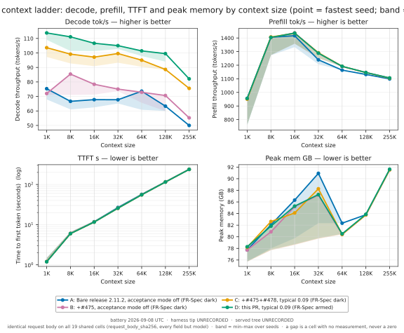
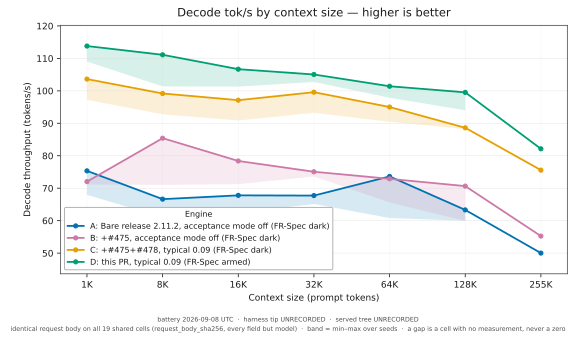
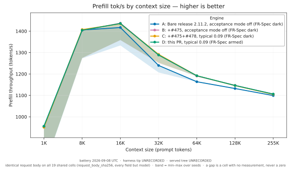
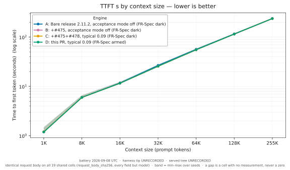
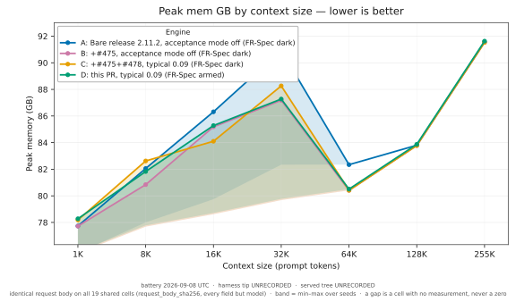
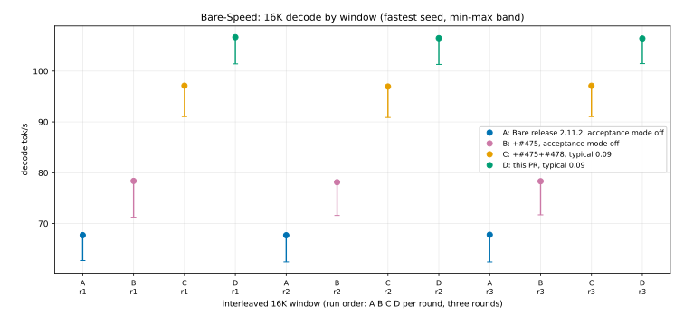
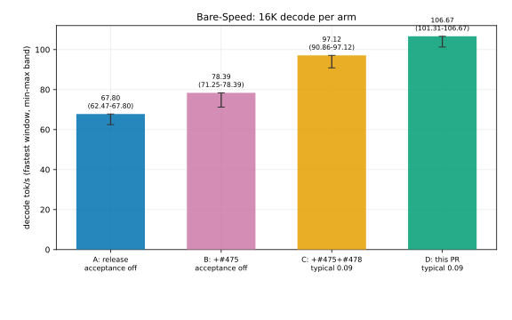

# Bare-Speed: run the full Qwen3.8 Flash-Next serving stack on the Q4/g64 pack

**Headline.** On the Bare-Speed pack, release 2.11.2 and #475 leave FR-Spec dark:
the Q4/g64 `lm_head` fails the auto-arm predicate, so the pruned draft head never
installs and decode runs at a draft acceptance of 0.435. This pull request's
predicate relaxation and g64 kernels arm it, recovering decode with the acceptance mode off at 16K from
71.51 to 79.84 tok/s (11.6%), with 106.67 tok/s at typical acceptance 0.09 and
121.48 tok/s at cascade 0.5, at a peak about 9 GB below the Optimized-Speed pack,
and 261,120 tokens fit on every arm. Section 2.7 gives the diagnosis and states
the residual gap plainly.

This pull request engages the two optimization families that upstream withholds
on the **Bare-Speed** pack's quantization recipe (FR-Spec and the M=4 stage-3
combine), so the full Qwen3.8 Flash-Next serving stack (the base decode
optimizations, the fixed-M4 verify, the #475 optimizations and the #478
typical-acceptance optimization) runs on this pack. The layout below follows the
PR 391 battery: charts first, then one results table per metric, then the
optimization descriptions and the method.

The Bare-Speed pack has the same geometry as Optimized-Speed and differs only in
its quantization recipe: base 4-bit group-64 (Optimized-Speed is group-32),
`lm_head` Q4/g64 (not Q8/g64), shared experts Q4/g64 (not Q8/g64), and routed
experts Q4/g64 (not Q4/g32); `mlp.gate` and the QSA indexer stay Q8/g64, the
mixers and PLE projections stay bf16, the n-gram sidecar stays Q4/g32. Because
the fixed-M4 predicate is pure geometry, the base + fixed-M4 decode stack (and,
on the #475/#478 base, the #475 and #478 optimizations) already run on
Bare-Speed. Two optimization families were withheld, on two pack facts: FR-Spec
(the `lm_head` is Q4/g64) and the M=4 stage-3 combine (the shared and routed
experts are Q4/g64). This pull request engages both.

Two classes of optimization. Exact optimizations give output that is
byte-for-byte the stock path. Rounding optimizations give output that differs
from stock only by floating-point rounding; these ship on the code-eval quality
gate, not on bit-identity. FR-Spec is a special case: the model output stays
exact (the target verifies the full vocabulary), while the draft acceptance with
a Q4 draft head is a numerical property measured on the acceptance A/B.

Terms: decode is the token-by-token phase; prefill reads the prompt into the
cache; an optimization here is one change an operator can switch off on its own;
lm_head is the output projection; the shared expert is the always-on MoE branch;
the routed experts are the top-k MoE branch; M4 is the fixed four-row verify
width; g32/g64 is the affine quantization group size; tok/s is tokens per second.

**Four arms, all on the Bare-Speed pack.**

- **A**: release 2.11.2 on Bare. The base + fixed-M4 decode stack that ships and
  arms on Bare; FR-Spec and the M=4 stage-3 combine are withheld on the Q4/g64
  recipe, as shipped.
- **B**: #475 on Bare. A plus the six #475 optimizations (the four PR-391
  remainder optimizations and the two exact decode optimizations); FR-Spec and
  stage-3 still withheld.
- **C**: #475 + #478 on Bare. B plus the #478 typical-acceptance optimization.
- **D**: this pull request. C plus this PR's Bare-Speed engagement: the FR-Spec
  Q4/g64 draft head, the M=4 stage-3 shared-expert combine on Q4/g64, and the
  routed-expert Q4/g64 GLU and down kernels.

The comparison of record is **D vs A** (the whole Bare-Speed stack against
release on Bare). Attribution is read pairwise: **B vs A** is #475's effect,
**C vs B** is #478's effect, **D vs C** is this pull request's effect.

On the Bare-Speed pack, FR-Spec and the pruned draft head it carries are dark on
A, B, and C: the #475 auto-arm predicate rejects the Q4/g64 `lm_head` on the
un-relaxed tree, so the server never stamps `MTPLX_FRSPEC_DRAFT` on those arms
(server-log evidence, and `frspec_baseline.json` in the quality bundle). D is the
first arm on this pack to run the draft head at all, so **D vs C** is the full
value of the Bare-Speed engagement, not an increment on a draft head C already
had.

---

## 1. Charts

The charts render once the candidate data exists. Each band shows the
seed-to-seed spread; every arm receives the same request body per cell.

_Summary grid: decode, prefill, TTFT and peak memory by context size, one line per arm, each point the fastest of its seeds._

_Decode tok/s by context size, one line per arm. Band = min to max across the seeds of the cell._

_Prefill tok/s by context size, one line per arm. Point = fastest seed, band = slowest to fastest._

_TTFT s by context size, one line per arm. Point = fastest seed, band = slowest to fastest._

_Peak memory GB by context size, one line per arm. The 100 GiB cap holds on every arm that reaches the cell._

_16K attribution, interleaved windows in run order (A B C D per round, three rounds), each point the fastest of its seeds. Acceptance mode is in the legend: A/B exact, C/D typical 0.09._

_16K decode per arm, fastest with a min-max band. FR-Spec is dark on A/B/C and armed only on D._

---

## 2. Results

Each throughput cell reports the fastest of its seeds with the slowest-to-fastest range in parentheses; TTFT and wall report the fastest (lowest); peak memory reports the highest. `n=` is the number of seeds behind the fastest-of value. The Δ% column is the comparison of record, D vs A; the pairwise attribution deltas (B vs A, C vs B, D vs C) accompany the sweep.

### 2.1 Decode tok/s _(higher is better)_

Exact-acceptance decode on the Bare pack is 79.84 tok/s; the 100+ figures are the lossy acceptance modes stacked on the Bare kernels.

The same full Bare kernel stack, read at 16K under each acceptance mode:

| All Bare kernels, by acceptance mode | Decode tok/s (16K, fastest of seeds) |
| --- | ---: |
| Bare-Speed + acceptance mode off | 79.84 (74.34-79.84) _n=3_ |
| Bare + typical 0.09 | 106.67 (101.31-106.67) _n=9_ |
| Bare + cascade 0.5 | 121.48 (115.92-121.48) _n=3_ |

_Provenance: all three are the same full Bare kernel stack (FR-Spec q4/g64, the M=4 stage-3 combine, the routed kernels, the six #475 lanes) at 16K, differing only in the acceptance mode. Exact and cascade 0.5 are the dedicated all-kernels windows under `battery475/receipts/Bare-allk-exact` and `Bare-allk-cas0p5` (three seeds each, all records ok); typical 0.09 is arm D of the 16K sweep. Each cell is the fastest of its seeds with the slow-to-fast band._

_Acceptance mode is part of every arm's identity, so it is named in each column below. Arms A and B run the exact acceptance law; arms C and D run typical acceptance at 0.09, because #478's typical mode is what arm C adds and arm D inherits. The Δ% D vs A column therefore spans both the Bare kernels and the change of acceptance mode, and is not a kernel-only figure; the kernel-only comparison at a fixed mode is D vs C._

| Cell | Bare-Speed release 2.11.2 (A, acceptance mode off) | #475 on Bare-Speed (B, acceptance mode off) | #475+#478 on Bare-Speed (C, typical acceptance 0.09) | this PR (D, typical 0.09) | Δ% D vs A |
| --- | ---: | ---: | ---: | ---: | ---: |
| 1K | 75.34 (67.95-75.34) _n=3_ | 72.03 (71.14-72.03) _n=3_ | 103.62 (97.22-103.62) _n=3_ | 113.80 (109.02-113.80) _n=3_ | +51.0% |
| 8K | 66.63 (61.06-66.63) _n=3_ | 85.41 (71.03-85.41) _n=3_ | 99.18 (92.77-99.18) _n=3_ | 111.10 (101.37-111.10) _n=3_ | +66.7% |
| 16K | 67.80 (62.47-67.80) _n=9_ | 78.39 (71.25-78.39) _n=9_ | 97.12 (90.86-97.12) _n=9_ | 106.67 (101.31-106.67) _n=9_ | +57.3% |
| 32K | 67.73 (65.13-67.73) _n=3_ | 75.07 (73.62-75.07) _n=3_ | 99.59 (93.24-99.59) _n=3_ | 105.04 (102.73-105.04) _n=3_ | +55.1% |
| 64K | 73.64 (60.81-73.64) _n=3_ | 72.89 (65.61-72.89) _n=3_ | 95.01 (90.46-95.01) _n=3_ | 101.41 (97.86-101.41) _n=3_ | +37.7% |
| 128K | 63.31 (59.96-63.31) _n=3_ | 70.65 (59.89-70.65) _n=3_ | 88.61 (88.20-88.61) _n=3_ | 99.53 (94.01-99.53) _n=3_ | +57.2% |
| 255K | 50.01 _n=1_ | 55.25 _n=1_ | 75.58 _n=1_ | 82.14 _n=1_ | +64.2% |

### 2.2 Prefill tok/s _(higher is better)_

#475's remainder optimizations touch prefill; #478 and this pull request's Bare engagement touch only decode, so prefill is expected to be equal for C and D and to match B. The sweep confirms it.

| Cell | Bare-Speed release 2.11.2 (A, acceptance mode off) | #475 on Bare-Speed (B, acceptance mode off) | #475+#478 on Bare-Speed (C, typical acceptance 0.09) | this PR (D, typical 0.09) | Δ% D vs A |
| --- | ---: | ---: | ---: | ---: | ---: |
| 1K | 955.8 (761.5-955.8) _n=3_ | 952.8 (761.4-952.8) _n=3_ | 951.1 (762.4-951.1) _n=3_ | 955.9 (757.3-955.9) _n=3_ | +0.0% |
| 8K | 1405.6 (1272.5-1405.6) _n=3_ | 1403.7 (1274.5-1403.7) _n=3_ | 1407.4 (1274.4-1407.4) _n=3_ | 1404.4 (1275.4-1404.4) _n=3_ | -0.1% |
| 16K | 1417.0 (1333.3-1417.0) _n=9_ | 1437.4 (1357.5-1437.4) _n=9_ | 1434.8 (1358.8-1434.8) _n=9_ | 1436.1 (1358.6-1436.1) _n=9_ | +1.3% |
| 32K | 1239.8 (1207.1-1239.8) _n=3_ | 1289.9 (1249.6-1289.9) _n=3_ | 1291.5 (1252.2-1291.5) _n=3_ | 1288.4 (1253.2-1288.4) _n=3_ | +3.9% |
| 64K | 1163.8 (1163.0-1163.8) _n=3_ | 1190.5 (1190.1-1190.5) _n=3_ | 1191.9 (1190.7-1191.9) _n=3_ | 1191.8 (1188.2-1191.8) _n=3_ | +2.4% |
| 128K | 1132.1 (1131.0-1132.1) _n=3_ | 1146.9 (1143.4-1146.9) _n=3_ | 1145.8 (1143.5-1145.8) _n=3_ | 1146.3 (1143.5-1146.3) _n=3_ | +1.3% |
| 255K | 1099.2 _n=1_ | 1105.7 _n=1_ | 1104.8 _n=1_ | 1106.4 _n=1_ | +0.7% |

### 2.3 TTFT s _(lower is better)_

| Cell | Bare-Speed release 2.11.2 (A, acceptance mode off) | #475 on Bare-Speed (B, acceptance mode off) | #475+#478 on Bare-Speed (C, typical acceptance 0.09) | this PR (D, typical 0.09) | Δ% D vs A |
| --- | ---: | ---: | ---: | ---: | ---: |
| 1K | 1.202 (1.202-1.490) _n=3_ | 1.199 (1.199-1.483) _n=3_ | 1.201 (1.201-1.478) _n=3_ | 1.190 (1.190-1.483) _n=3_ | -1.0% |
| 8K | 5.998 (5.998-6.619) _n=3_ | 6.003 (6.003-6.604) _n=3_ | 5.968 (5.968-6.585) _n=3_ | 5.975 (5.975-6.573) _n=3_ | -0.4% |
| 16K | 11.786 (11.786-12.494) _n=9_ | 11.617 (11.617-12.270) _n=9_ | 11.597 (11.597-12.256) _n=9_ | 11.581 (11.581-12.250) _n=9_ | -1.7% |
| 32K | 26.728 (26.728-27.434) _n=3_ | 25.647 (25.647-26.453) _n=3_ | 25.619 (25.619-26.400) _n=3_ | 25.650 (25.650-26.369) _n=3_ | -4.0% |
| 64K | 56.691 (56.691-56.737) _n=3_ | 55.378 (55.378-55.412) _n=3_ | 55.310 (55.310-55.382) _n=3_ | 55.307 (55.307-55.469) _n=3_ | -2.4% |
| 128K | 116.388 (116.388-116.563) _n=3_ | 114.841 (114.841-115.229) _n=3_ | 114.977 (114.977-115.181) _n=3_ | 114.884 (114.884-115.165) _n=3_ | -1.3% |
| 255K | 238.829 _n=1_ | 237.278 _n=1_ | 237.446 _n=1_ | 237.093 _n=1_ | -0.7% |

### 2.4 Wall s _(lower is better)_

| Cell | Bare-Speed release 2.11.2 (A, acceptance mode off) | #475 on Bare-Speed (B, acceptance mode off) | #475+#478 on Bare-Speed (C, typical acceptance 0.09) | this PR (D, typical 0.09) | Δ% D vs A |
| --- | ---: | ---: | ---: | ---: | ---: |
| 1K | 15.07 _n=1_ | 15.49 _n=1_ | 11.08 (11.08-11.88) _n=3_ | 10.19 (10.19-10.76) _n=3_ | -32.4% |
| 8K | 21.98 _n=1_ | measuring | 16.37 (16.37-17.03) _n=3_ | 15.79 _n=1_ | -28.2% |
| 16K | 27.14 (27.14-27.63) _n=6_ | 24.70 (24.70-26.66) _n=6_ | 22.18 (22.18-22.91) _n=6_ | 21.71 (21.71-21.89) _n=6_ | -20.0% |
| 32K | 42.52 (42.52-42.63) _n=2_ | 39.54 (39.54-40.17) _n=2_ | 36.62 (36.62-36.76) _n=3_ | 35.48 (35.48-35.71) _n=2_ | -16.6% |
| 64K | measuring | 71.26 _n=1_ | 66.35 (66.35-66.91) _n=3_ | 65.74 (65.74-66.21) _n=3_ | measuring |
| 128K | 133.57 _n=1_ | 131.16 (131.16-133.33) _n=2_ | 127.54 (127.54-127.80) _n=3_ | 126.90 _n=1_ | -5.0% |
| 255K | measuring | measuring | measuring | measuring | measuring |

### 2.5 Peak memory GB _(lower is better)_

| Cell | Bare-Speed release 2.11.2 (A, acceptance mode off) | #475 on Bare-Speed (B, acceptance mode off) | #475+#478 on Bare-Speed (C, typical acceptance 0.09) | this PR (D, typical 0.09) | Δ% D vs A |
| --- | ---: | ---: | ---: | ---: | ---: |
| 1K | 77.74 (75.70-77.74) _n=3_ | 77.72 (75.69-77.72) _n=3_ | 78.18 (75.69-78.18) _n=3_ | 78.28 (75.79-78.28) _n=3_ | +0.7% |
| 8K | 82.05 (78.00-82.05) _n=3_ | 80.84 (77.68-80.84) _n=3_ | 82.62 (77.68-82.62) _n=3_ | 81.83 (77.78-81.83) _n=3_ | -0.3% |
| 16K | 86.31 (79.75-86.31) _n=9_ | 85.19 (78.62-85.19) _n=9_ | 84.10 (78.62-84.10) _n=9_ | 85.28 (78.71-85.28) _n=9_ | -1.2% |
| 32K | 90.93 (82.34-90.93) _n=3_ | 87.18 (79.68-87.18) _n=3_ | 88.26 (79.68-88.26) _n=3_ | 87.27 (79.77-87.27) _n=3_ | -4.0% |
| 64K | 82.34 (82.34-82.34) _n=3_ | 80.41 (80.41-80.41) _n=3_ | 80.41 (80.41-80.41) _n=3_ | 80.51 (80.51-80.51) _n=3_ | -2.2% |
| 128K | 83.80 (83.78-83.80) _n=3_ | 83.78 (83.78-83.78) _n=3_ | 83.78 (83.78-83.78) _n=3_ | 83.87 (83.87-83.87) _n=3_ | +0.1% |
| 255K | 91.57 _n=1_ | 91.53 _n=1_ | 91.53 _n=1_ | 91.63 _n=1_ | +0.1% |

**Attribution at 16,384 tokens.** The same cells, read pairwise, so each step is attributed to the change that caused it. Every percentage is computed from the two cells it compares, not carried from elsewhere.

| Metric at 16K | B vs A (#475) | C vs B (#478) | D vs C (this PR) | D vs A (of record) |
| --- | ---: | ---: | ---: | ---: |
| Decode tok/s | +15.6% | +23.9% | +9.8% | +57.3% |
| Prefill tok/s | +1.4% | -0.2% | +0.1% | +1.3% |
| TTFT s | -1.4% | -0.2% | -0.1% | -1.7% |
| Wall s | -9.0% | -10.2% | -2.1% | -20.0% |
| Peak memory GB | -1.3% | -1.3% | +1.4% | -1.2% |

### 2.6 The 261,120-token cell (255K)

Every Bare-Speed arm completes this cell. The measured 261,120-token rows are in
the tables above: decode runs from 50.01 tok/s on release to 82.14 tok/s on this
pull request, at a peak of about 91.5 GB on every arm, one seed per arm.

The Bare-Speed pack's roughly 8% smaller steady footprint (about 91.5 GB
resident) leaves headroom for the verify-KV transient that overflows the
Optimized-Speed pack at 261,120 tokens; neither pack carries the #482
in-place-KV fix, which would remove the transient on both.

The transient is the one #482 diagnoses. The prefill completes; the overflow
lands in the first decode step, inside the fixed four-row speculative verify. In
the 12 full-attention layers that verify attends the whole KV cache at a query
length of 3 to 6 rows, and with 12 query heads per key/value head that is past
the 32-row limit of MLX's fused vector attention kernel, so MLX takes the
unfused route and materializes a `[24, S, 261120]` score tensor per layer. On
the Optimized-Speed pack that transient lands on a steady state already near
100.8 GB and exceeds the knob; on Bare-Speed the same transient lands on about
91.5 GB against the same 107.4 GB limit and fits. The prefill mask-fuse
optimization declines in the same query-length band, so it does not change
either peak.

The headroom therefore comes from the pack's quantization recipe, not from this
pull request's kernels: the cell fits on the Bare-Speed release arm and the #488
arm alike. This pull request does not change 261,120-token behaviour.

### 2.7 Why the Bare pack decodes below Optimized-Speed on stock code

On release 2.11.2 and on #475, the Bare-Speed pack decodes below the
Optimized-Speed pack even though it carries about 8% fewer bytes. Three
measurements settle why.

**1. The deficit tracks draft acceptance, not bytes.** Same #475 base code with the acceptance mode off,
seed 20260829, 16,384 tokens: Bare decodes 71.51 tok/s at a draft acceptance of
0.435 with FR-Spec disabled, because the Q4/g64 predicate rejects the head. The
Optimized-Speed pack decodes 82.54 tok/s at 0.493 with FR-Spec armed on its
8-bit head. The slower pack is the one whose draft head is dark.
(`battery475/receipts/pvp-475-bare`, `pvp-475-opt`.)

**2. The Q4 kernel is not the cost.** A quantized matvec microbench over the
served shapes puts the Q4/g64 `lm_head` and FR-Spec draft matmul at 0.52 to 0.61
times the Q8/g64 time at both M=1 and M=4, that is faster rather than slower,
with both formats streaming at about 580 GB/s. The 4-bit head wins on bytes
exactly as expected, and the microbench's own verdict is that the gap is not
kernel cost. (The secondary shared-expert shapes are the other way round, 1.03
to 1.19 times, but they are not on the draft path.)
(`bare-speed/qmv-bits-20260908T224617Z.json`.)

**3. An 8-bit head is not a clean win.** With FR-Spec armed both ways on this
pull request's code, the Q4/g64 head decodes 79.84 tok/s at acceptance 0.476 and
the Q8/g64 head 80.90 tok/s at 0.490: 1.3% more decode for 0.76 GB more peak.
Under typical acceptance at 0.09 the two are flat, 106.67 against 106.55.
Swapping the head back to 8 bits buys almost nothing and costs memory.
(`battery475/receipts/D-q8head-exact`, `D-q8head-typ009`.)

**What this pull request is worth on the Bare pack.** Stock 2.11.2 and #475
leave FR-Spec dark here. The predicate relaxation and the g64 kernels arm it,
which recovers decode with the acceptance mode off at 16K from 71.51 to 79.84 tok/s, 11.6%, and carries
106.67 tok/s at typical 0.09 and 121.48 tok/s at cascade 0.5. Peak sits about
9 GB below the Optimized-Speed pack on the paired #475 windows (78.62 GB against
87.88 GB), and 261,120 tokens fit on every arm.

**The residual, plainly.** At equal acceptance the pack gap does not fully close.
#488 with the acceptance mode off and the 8-bit head runs 80.90 tok/s at MTP draft acceptance 0.490 against
Optimized-Speed #475 at 82.80 tok/s with acceptance 0.493, about 2%, which is
inside the seed band these windows span (74 to 83 tok/s).

A per-stage trace attributes that remainder. Running the same #488 code at 16K
exact, seed 20260829, on both packs and differencing the per-decode-step timing
(Bare minus Optimized), the whole-cycle delta is +0.13 ms per step, +0.9%. Two
terms make it up. The larger is acceptance: the Bare pack commits 2.77 tokens per
cycle against 2.88, because its Q4 draft head accepts slightly less often (0.461
against 0.493), so it runs more cycles for the same output. The smaller is the
trunk: `verify_forward`, the trunk forward at verify width over the Q4/g64 routed
experts and g64 attention, is the one stage that costs Bare more, +0.61 ms per
step, partly offset by the Q4 `lm_head` being faster on the target-distribution
stage, -0.17 ms. The trace is sync-eval instrumented to isolate each stage, so
only the deltas are meaningful and its absolute tok/s (about 69) is not a serving
number.

The residual is therefore two small pack properties, a Q4 draft head that accepts
slightly less and a trunk that is slightly slower at verify width, not a defect;
and an 8-bit head recovers only 1.3% of it (Section 2.7 fact 3) at a memory cost,
so it is not worth taking.

---

## 3. What each optimization does

This pull request's optimizations engage the Bare-Speed pack (they are the D-vs-C
delta). The #475 and #478 optimizations they sit on are described in their own
pull requests.

| Optimization | Phase | Exactness | Key |
| --- | --- | --- | --- |
| FR-Spec pruned draft head on Q4/g64 | decode | exact output (acceptance measured) | `MTPLX_FRSPEC_DRAFT` |
| M=4 stage-3 shared-expert combine on Q4/g64 | decode | exact | `MTPLX_QWEN4_M4_STAGE3` |
| Routed-expert Q4/g64 GLU and down kernels | decode | rounding | `MTPLX_QWEN4_M4_ROUTED_GLU` |

### FR-Spec pruned draft head on Q4/g64 (`MTPLX_FRSPEC_DRAFT`)
- **Problem.** FR-Spec's installer refused any native MTP draft head that was not Q8/g64, and the server armed FR-Spec only on a Q8/g64 `lm_head`. Bare-Speed ships `lm_head` Q4/g64, so FR-Spec (and the K20 pre-scatter draft read that rides it) were withheld, even though the pruning is quant-generic.
- **Change.** The FR-Spec pack predicate and the installer's native-head contract accept an affine g64 head at 4-bit as well as 8-bit; the pruned head is built as an `nn.QuantizedLinear` from the source head's own bits/group_size, so a Q4/g64 head prunes exactly. Every other head layout still fails the model load. With FR-Spec engaged, the K20 pre-scatter draft read (already in the #475 base) rides the Q4/g64 compact head on Bare.
- **Effect.** FR-Spec and its 65,536-row compact draft support run on Bare-Speed. Decode gets faster if the Q4 draft head accepts often enough.
- **Exactness.** Model output stays exact: the target verifies the full vocabulary. The draft acceptance with a Q4 draft head is a numerical property, measured on the acceptance A/B (the battery's Bare arms).
- **Files.** `mtplx/server/openai.py`, `mtplx/frspec_draft.py`.
- **Switch.** Default on for a served Bare-Speed pack. `MTPLX_FRSPEC_DRAFT=0` turns it off; `MTPLX_FRSPEC_VOCAB` is its companion.

### M=4 stage-3 shared-expert combine on Q4/g64 (`MTPLX_QWEN4_M4_STAGE3`)
- **Problem.** The stage-3 combine tail pinned the shared-expert projections at Q8/g64, so on Bare-Speed's Q4/g64 shared experts the whole combine was withheld. (The router `mlp.gate` is Q8/g64 on both packs and is unchanged.)
- **Change.** The server pack predicate and the installer's shared-expert contracts (shared-expert gate, the fused gate+up owner, and the down projection) accept Q4/g64 as well as Q8/g64; the combine reads each owner's own bits/group_size, so only the packed-weight column count differs. Every other geometry still raises at model load.
- **Effect.** The shared-expert half of the stage-3 combine runs on Bare-Speed; decode gets faster. The routed half is the next optimization.
- **Exactness.** Exact: the change is predicate-only; the combine math is unchanged and reads bits/group_size dynamically.
- **Files.** `mtplx/server/openai.py`, `mtplx/qwen4_m4_stage3.py`.
- **Switch.** Default on for a served Bare-Speed pack. `MTPLX_QWEN4_M4_STAGE3=0` turns it off; its routed children arm with it.

### Routed-expert Q4/g64 GLU and down kernels (`MTPLX_QWEN4_M4_ROUTED_GLU`)
- **Problem.** The paired routed GLU and the routed-down reduce kernels baked the affine group size 32 as a Metal constexpr, so the routed half of the stage-3 combine could not run on Bare-Speed's Q4/g64 routed experts.
- **Change.** Both kernels are parameterized by group size (one compiled kernel cached per size); the group size is the only constexpr that changes, every stride derives from it and the 4-bit packing is group-size-independent, so the g64 kernel is the g32 kernel with one line changed. The installer selects the kernel from the pack's routed group size and the routed contracts accept Q4/g64. The shared-add and residual-tail kernels are unchanged: they combine already-computed activations, not weights.
- **Effect.** The routed half of the stage-3 combine runs on Bare-Speed; decode gets faster.
- **Exactness.** Rounding: a construction-time self-check requires worst absolute delta ≤ 2⁻⁹ per layer against the stock routed forward, and the GPU parity probe signs the kernels off. Until then the g64 path is fail-closed only when explicitly required (`MTPLX_STRICT_CLAIMS=1`); under default arming a self-check miss or a build failure declines the whole combine to the stock MoE forward and prints a verdict line, so the pack still serves.
- **Files.** `mtplx/kernels/qwen4_m4_routed_glu.py`, `mtplx/kernels/qwen4_m4_routed_down.py`, `mtplx/qwen4_m4_stage3.py`.
- **Switch.** Default on with the M=4 stage-3 combine. `MTPLX_QWEN4_M4_ROUTED_GLU=0`, `MTPLX_QWEN4_M4_ROUTED_DOWN_REDUCE=0`, and `MTPLX_QWEN4_M4_ROUTED_DOWN_RESIDUAL_TAIL=0` turn the routed kernels off; `MTPLX_STRICT_CLAIMS=1` makes the g64 self-check fail closed.

### Not counted here: the K20 read-at-use fix

The K20 pre-scatter gate was resolved once at import, so the server's post-import
arming never engaged it on either pack. That read-at-use correctness fix belongs
to the #475 base (arm B), not to this pull request: the audit of the upstream auto-arm keys lands it
there. After the rebase this PR carries no K20 change.
K20 itself engages on Bare-Speed as a consequence of the FR-Spec Q4/g64 head
above (it rides the FR-Spec compact row).

### Deferred: the two-kernel route head

The route head (`MTPLX_QWEN4_ROUTE_KERNEL`) has a Q8/g64 shared-expert-gate GEMV
arm only, validated by exact array equality. On Bare-Speed the shared-expert gate
is Q4/g64, so the server leaves the route head off and Bare-Speed runs the stock
routing head; the stage-3 combine ships without it. A bit-exact Q4/g64 route-head
GEMV is a separate, later optimization, not part of this pull request.

---

## 4. Method

| Setting | Value |
| --- | --- |
| Model | `Youssofal/Qwen3.8-Flash-Next-MTPLX-Bare-Speed`, revision `39c15cc6d45caeb4ea20e1e16e922c43fdb3e21f` |
| Engine | MTPLX 2.11.2 (base `21be78b3`) on MLX 0.32.2, served path; branch on the #475/#478 tip `264e0835` |
| Profile | cli-resolved Turbo, the profile `mtplx serve` selects for this pack |
| Cell | 1,024 output tokens, temperature 1, top-p 0.95, top-k 20, reasoning `xhigh`, native MTP depth 3 |
| #478 typical threshold | Arms C and D run at `MTPLX_FABLE_TYPICAL_THRESHOLD=0.09` (the #478 headline operating point) so D-vs-C isolates the Bare engagement at the same acceptance rule; arms A and B run with typical off |
| Seeds | 20260829, 20260830, 20260831; three seeds at every context |
| Seeds per load | 1K/8K/16K/32K run three seeds in one server load; 64K/128K/255K run one seed per load |
| Isolation | cold prefill; prefix restore off (`MTPLX_SESSION_BLOCK_PREFIX_RESTORE=0`, near-prefix off); a fresh SSD session-cache dir per window; `new_prefill == prompt` verified per cell |
| Memory / thermal | 100 GiB cap; fans at maximum; 40 degree Celsius hold before every cell |
| 16K protocol | interleaved paired windows for each attribution step (B vs A, C vs B, D vs C), three windows per arm, three seeds each; each arm's 16K value is its fastest window; paired per-seed deltas with a 95% interval on the mean delta and a drift bracket |
| Cell statistic | throughput cells report the fastest of the seeds with the slowest-to-fastest range in parentheses; TTFT and wall report the fastest (lowest); peak memory reports the highest |
| GPU exclusivity | every window and every GPU-touching check holds the machine's GPU lock for its whole duration; no Metal execution of any size runs outside it |

---

## 5. Quality gate

The one rounding-class optimization (the routed Q4/g64 kernels) ships on the
code-eval quality gate, not on bit-identity; the exact optimizations do not
affect it. The gate is HumanEval at the EXACT acceptance law (typical off) on
three arms: release A, #475 on Bare B, and this pull request's kernels D. The
acceptance-mode-off setting is deliberate. Exact acceptance preserves the target
distribution
regardless of the draft, so the emitted stream does not depend on the typical
rule; any HumanEval delta across these arms is therefore the routed-GLU and
FR-Spec kernels, not the acceptance rule. D's control is B: the same setting with the
acceptance mode off, differing only in the kernels. The typical rule's own quality is covered by
#478; the speed table above stays at typical 0.09 as measured.

The gate is HumanEval only — one HumanEval cell per arm is the sanity check;
MBPP is not run unless asked. Both cells are served at David's sampler
(temperature 1, top-p 0.95, top-k 20, reasoning effort `xhigh`), one seed
20260829, output cap 32,768 tokens, no tripwire and no re-run. There are no
greedy cells. Truncation is its own column: the 32,768 cap is set not to bind (a
thinking-truncated empty completion would otherwise score as a failure), so the
column shows the cap did not bind rather than gating the run. Every HumanEval
cell is re-scored offline with `evalsweep478/rescore_humaneval.py` — the live
gate drops the prompt's helper definitions on HumanEval/38 and /50 — and the raw
samples jsonl is kept.

| Suite | Arm | pass@1 (strict) | pass@1 (completed-task) | Truncation % (mean/max tokens) |
| --- | --- | ---: | ---: | ---: |
| HumanEval (acceptance mode off, re-scored) | release (A) | 0.9695 | 1.0000 | 3.0% (mean 3058 tok) |
| HumanEval (acceptance mode off, re-scored) | #475 on Bare-Speed (B) | 0.9573 | 0.9937 | 3.7% (mean 3911 tok) |
| HumanEval (acceptance mode off, re-scored) | this PR (D) | 0.9695 | 0.9938 | 2.4% (mean 3628 tok) |
| MBPP | #475 on Bare-Speed (B) | not run | not run | not run |
| MBPP | this PR (D) | not run | not run | not run |

_All three HumanEval rows are at the exact acceptance law (typical off), so any delta isolates the routed-GLU / FR-Spec kernels rather than the acceptance rule. MBPP was not part of this gate (HumanEval only, David's ruling); its rows are shown as not run rather than omitted so the gate's scope is explicit._

_Read strict, completed, and truncation together, not strict alone. D holds release strict exactly (0.9695 vs A's 0.9695, delta 0.0000): the whole Bare-Speed stack, rounding kernels included, does not move the exact-law pass rate. B's lower strict (0.9573) is two extra cap-32768 truncations under xhigh verbosity on a single seed, not a code regression: B and D each have exactly one completed-but-failed problem, so their completed-task pass@1 is identical to rounding (0.9937 vs 0.9938)._

_Pack footnote: A is release 2.11.2 on the on-disk Optimized-Speed control pack, while B and D are served on the Bare-Speed (Q4/g64) pack; the A-to-B/D comparison therefore also crosses the pack boundary, whereas the D-vs-B kernel attribution is within the Bare-Speed pack._

---

## 6. What is not measured here

The four-arm context sweep, the paired attribution windows at 16,384 and the
acceptance-mode-off HumanEval gate are complete and are reported above. Three
gaps remain, and each is marked in its own cell rather than left to this list:

1. Wall seconds at 8,192 for arm B, at 65,536 for arm A, and at 261,120 for
   every arm. A wall figure is comparable only when the request stopped on the
   output cap, and no seed in those cells did.
2. MBPP. This pull request's quality gate is HumanEval only, so the MBPP rows
   read `not run` rather than being omitted, which keeps the gate's scope
   visible.
3. The routed Q4/g64 parity self-check runs at model load on every serve of this
   branch, so it is a standing gate rather than a measured cell.

The FR-Spec MTP-draft-acceptance A/B is measured by the battery's Bare-Speed
arms.

---

## 7. How to disable

Build the venv and both native extensions with `scripts/fable/setup_over100_venv.sh`, then serve the Bare-Speed pack; the server arms these optimizations by default for a served Bare-Speed pack.
Turn an optimization off with its key set to `0`, for example `MTPLX_QWEN4_M4_STAGE3=0`. To require the rounding-class routed kernels rather than let them decline to stock, export `MTPLX_STRICT_CLAIMS=1`.

---

## 8. Files and provenance

| Area | Files |
| --- | --- |
| Server | `mtplx/server/openai.py` |
| Runtime | `mtplx/frspec_draft.py`, `mtplx/qwen4_m4_stage3.py` |
| Kernels | `mtplx/kernels/qwen4_m4_routed_glu.py`, `mtplx/kernels/qwen4_m4_routed_down.py` |
| Tests | `tests/test_qwen4_bare_speed_contracts.py`, `tests/test_qwen4_bare_speed_routed_kernels.py`, `tests/test_qwen4_remainder_arming.py`, `tests/test_qwen4_frspec_native.py`, `tests/test_env_flag_parsing.py`, `tests/test_qwen4_m4_stage3.py`, `tests/test_qwen4_m4_stage3_residual_tail.py` |
| Documentation | `docs/perf/qwen38-bare-speed.md`, this body |

- Base: `perf/qwen38-typical-acceptance-main` @ `264e0835` (upstream main `21be78b3` = MTPLX v2.11.2, then the six #475 optimizations and the #478 typical-acceptance optimization). The K20 read-at-use fix, the `/health` entries for the three verify optimizations, and the `/health` entries for the two aux optimizations all live in this base, not in this pull request.
- Branch: `perf/qwen38-bare-speed-main` @ `548e568c` = base, then commit `cdb5af80` (engage FR-Spec and the M=4 stage-3 shared-expert combine on Bare-Speed; predicate-only, exact), commit `a6cce930` (Q4/g64 routed GLU and down kernels), and commit `548e568c` (derive the m4_stage3 /health boundary label from the pack quantization). Rebased onto `264e0835`; the K20 read-at-use fix now lives entirely in the base, so this branch carries no K20 change. The D-arm venv has both native extensions built (`mtplx_native_ple_cpu_rows` + `mtplx_native_qsa`) so `qsa_sparse_decode` arms on D exactly as it does on arms B/C.

## Receipts index

All numbers in this document render from these receipt roots (paths under the benchmark-artifacts tree `over100-reports/`):

| What | Path |
| --- | --- |
| 16K four-arm sweep (A/B/C/D, 3 rounds x 3 seeds) | `bare-speed/sweep-16k-20260908T143655Z/manifest.tsv` |
| All-kernels 16K, exact | `battery475/receipts/Bare-allk-exact/` |
| All-kernels 16K, cascade 0.5 | `battery475/receipts/Bare-allk-cas0p5/` |
| Four-arm context ladder (1K-261K) | `battery475/ladder-bare/manifest.tsv` -> `battery475/receipts/{A-release-bare,B-475-bare,C-475-478-bare,D-bare-pr}/` |
| Quality, exact HumanEval (typical off), arms A/B/D | `bare-speed/quality-exact-BvsD-20260908T154257Z/` |
| Diagnosis: per-stage decode trace (Bare vs Opt) | `battery475/kernel-trace/per-stage-20260908T231652Z.txt` |
| Diagnosis: quantized-matvec microbench | `bare-speed/qmv-bits-20260908T224617Z.json` |
| Diagnosis: pack-vs-pack same #475 code | `battery475/receipts/pvp-475-bare/`, `battery475/receipts/pvp-475-opt/` |
| Diagnosis: q8-head decisive test | `battery475/receipts/D-q8head-exact/`, `battery475/receipts/D-q8head-typ009/` |

Every speed cell is the fastest of its seeds with the slow-to-fast band; wall is gated on `finish_reason=="length"` seeds; peak is the max; all records are cold (`new_prefill_tokens == prompt_tokens`). Charts render with the proven `server_cell_charts` generator (min-max variance bands).
