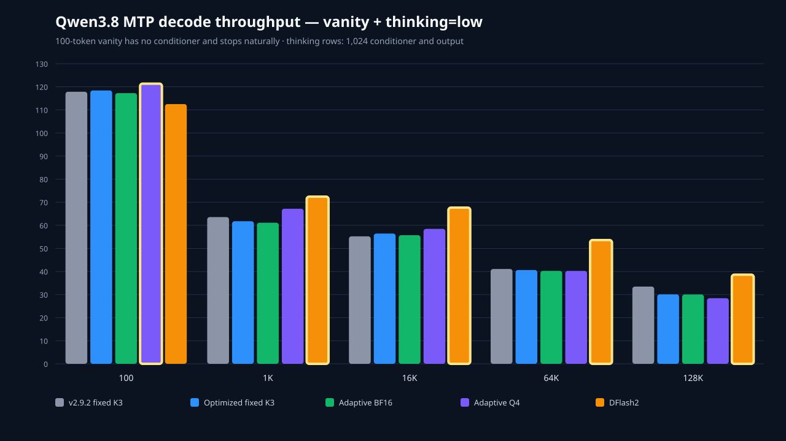
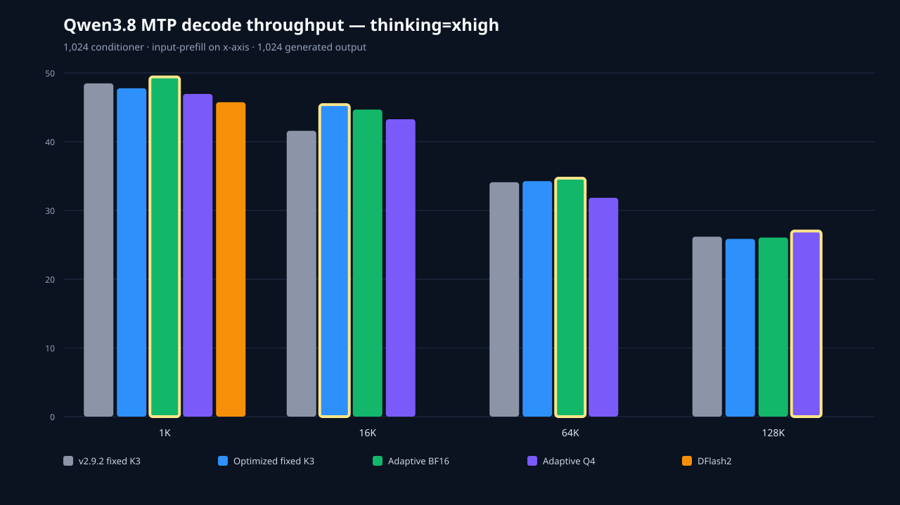

# Qwen3.8 native-MTP optimized profiles

This receipt replaces the earlier campaign. Every measured candidate uses MLX and Metal 0.32.2. The thinking matrices use a 1,024-token same-prompt conditioner, the Qwen thinking template, temperature 1.0, top-p 0.95, top-k 20, seed 42, and exactly 1,024 generated tokens. The x-axis is input-prefill length—not output length.

The optimized fixed-K3 lane uses the matched optimized route and remains pinned at K=3 without executing adaptive depth. Adaptive BF16 and Adaptive Q4 use the same workload-specific optimized profile plus the existing `--adaptive-policy position_ema` toggle. The v2.9.2 lane is exact source `bbc67427e88288001e4b90ecb44708dc0222154c` with only MLX/Metal upgraded. DFlash2 is exact source `9a6f48e69f9c8c6932d0f005c364844b2bf33e9c`.

Every current native lane other than v2.9.2 uses a measured optimized shared profile. Low uses `r20_kv_only_history+r53_command_buffers+r08_device_draft+r10_compact_vocab+r21_qk_rms_rope+r24_eval_ladder+r26_prefill_ladder_3`; xhigh uses `r20_kv_only_history+r24_eval_ladder+r26_prefill_ladder_3+r50_wired_residency+r53_command_buffers`. Fixed K3 uses the applicable shared profile without `r11`; Adaptive BF16 adds `r11_position_ema`; Adaptive Q4 adds `r11_position_ema+r17_q4_mtp_block`. DFlash2 uses its separate PR335 optimized comparator path.

The custom Q4 head is retained for further benchmarking but is not published: it wins low at 1K and 16K, then loses low at 64K and 128K and loses three of four xhigh rows. That matched evidence does not justify a supported artifact yet.

Winner highlights use lowest wall time at each input/prefill size. The charts still plot decode tok/s; their gold outline marks the wall-time winner.

## 100-token temperature-zero vanity prompt

No conditioner or prefill-generation pass is used. All five candidates stop naturally at the same 102-token output.

| Input | Candidate | Output | Prefill tok/s | Decode tok/s | Wall (s) | vs optimized fixed | Peak GiB |
|---:|---|---:|---:|---:|---:|---:|---:|
| 100 | v2.9.2 fixed K3 | 102 natural | 489.88 | 117.85 | 1.081 | +0.58% | 20.343 |
| 100 | Optimized fixed K3 | 102 natural | 463.65 | 118.40 | 1.087 | baseline | 20.412 |
| 100 | Adaptive BF16 | 102 natural | 468.80 | 117.24 | 1.093 | -0.55% | 20.412 |
| 100 | **★ Adaptive Q4** | 102 natural | 486.05 | 121.35 | 1.055 | +3.02% | 20.620 |
| 100 | DFlash2 | 102 natural | 461.68 | 112.51 | 1.154 | -5.82% | 19.798 |

## Thinking=low — 1,024 output tokens



| Input | Candidate | Output | Prefill tok/s | Decode tok/s | Wall (s) | vs optimized fixed | Peak GiB |
|---:|---|---:|---:|---:|---:|---:|---:|
| 1K | v2.9.2 fixed K3 | 1024 | 751.16 | 63.56 | 17.502 | +2.90% | 21.375 |
| 1K | Optimized fixed K3 | 1024 | 732.72 | 61.76 | 18.010 | baseline | 27.832 |
| 1K | Adaptive BF16 | 1024 | 756.91 | 61.13 | 18.138 | -0.71% | 27.832 |
| 1K | Adaptive Q4 | 1024 | 780.17 | 67.17 | 16.583 | +8.60% | 28.040 |
| 1K | **★ DFlash2** | 1024 | 766.93 | 72.41 | 15.518 | +16.06% | 27.881 |
| 16K | v2.9.2 fixed K3 | 1024 | 802.40 | 55.21 | 39.394 | -2.59% | 23.469 |
| 16K | Optimized fixed K3 | 1024 | 815.33 | 56.42 | 38.373 | baseline | 36.038 |
| 16K | Adaptive BF16 | 1024 | 815.00 | 55.71 | 38.606 | -0.60% | 36.038 |
| 16K | Adaptive Q4 | 1024 | 814.74 | 58.45 | 37.775 | +1.58% | 36.247 |
| 16K | **★ DFlash2** | 1024 | 789.86 | 67.65 | 35.915 | +6.84% | 36.746 |
| 64K | v2.9.2 fixed K3 | 1024 | 681.59 | 41.08 | 123.790 | -1.14% | 28.658 |
| 64K | Optimized fixed K3 | 1024 | 678.21 | 40.63 | 122.378 | baseline | 36.039 |
| 64K | Adaptive BF16 | 1024 | 678.64 | 40.26 | 122.538 | -0.13% | 36.038 |
| 64K | Adaptive Q4 | 1024 | 679.18 | 40.25 | 122.451 | -0.06% | 36.247 |
| 64K | **★ DFlash2** | 1024 | 661.39 | 53.60 | 118.287 | +3.46% | 37.230 |
| 128K | v2.9.2 fixed K3 | 1024 | 552.62 | 33.46 | 276.035 | -0.96% | 37.061 |
| 128K | Optimized fixed K3 | 1024 | 550.48 | 30.09 | 273.378 | baseline | 38.892 |
| 128K | Adaptive BF16 | 1024 | 550.87 | 30.05 | 273.218 | +0.06% | 38.892 |
| 128K | Adaptive Q4 | 1024 | 548.03 | 28.42 | 276.328 | -1.07% | 39.101 |
| 128K | **★ DFlash2** | 1024 | 539.43 | 38.61 | 269.678 | +1.37% | 40.039 |

## Thinking=xhigh — 1,024 output tokens



| Input | Candidate | Output | Prefill tok/s | Decode tok/s | Wall (s) | vs optimized fixed | Peak GiB |
|---:|---|---:|---:|---:|---:|---:|---:|
| 1K | v2.9.2 fixed K3 | 1024 | 713.53 | 48.48 | 22.584 | +1.69% | 21.375 |
| 1K | Optimized fixed K3 | 1024 | 680.99 | 47.77 | 22.965 | baseline | 27.568 |
| 1K | **★ Adaptive BF16** | 1024 | 673.72 | 49.42 | 22.264 | +3.15% | 27.568 |
| 1K | Adaptive Q4 | 1024 | 709.32 | 46.95 | 23.281 | -1.36% | 27.776 |
| 1K | DFlash2 | 1024 | 703.31 | 45.74 | 23.896 | -3.89% | 27.881 |
| 16K | v2.9.2 fixed K3 | 1024 | 791.27 | 41.58 | 45.761 | -5.39% | 23.469 |
| 16K | **★ Optimized fixed K3** | 1024 | 792.82 | 45.39 | 43.293 | baseline | 35.774 |
| 16K | Adaptive BF16 | 1024 | 792.65 | 44.67 | 43.660 | -0.84% | 35.775 |
| 16K | Adaptive Q4 | 1024 | 794.51 | 43.26 | 44.358 | -2.40% | 35.983 |
| 64K | v2.9.2 fixed K3 | 1024 | 677.30 | 34.10 | 129.498 | -1.38% | 29.399 |
| 64K | Optimized fixed K3 | 1024 | 671.95 | 34.26 | 127.712 | baseline | 35.774 |
| 64K | **★ Adaptive BF16** | 1024 | 670.38 | 34.69 | 127.563 | +0.12% | 35.774 |
| 64K | Adaptive Q4 | 1024 | 672.83 | 31.84 | 129.864 | -1.66% | 35.983 |
| 128K | v2.9.2 fixed K3 | 1024 | 548.71 | 26.18 | 286.381 | -3.06% | 37.121 |
| 128K | Optimized fixed K3 | 1024 | 552.19 | 25.86 | 277.627 | baseline | 38.628 |
| 128K | Adaptive BF16 | 1024 | 551.57 | 26.06 | 277.595 | +0.01% | 38.628 |
| 128K | **★ Adaptive Q4** | 1024 | 550.10 | 27.00 | 276.894 | +0.26% | 38.837 |

DFlash2 is intentionally measured only at the 1K-input xhigh row.

## 128K adaptive-depth telemetry

Attempted and accepted shares are speculative decode-cycle shares derived from the recorded schedule events; they are not shares of wall time. Fixed K3 is excluded because it remains pinned at depth 3 and never executes the adaptive policy.

### Thinking=low

| Candidate | Cycles | Attempt D0 | D1 | D2 | D3 | Accept D0 | D1 | D2 | D3 | Mean attempted | Mean accepted |
|---|---:|---:|---:|---:|---:|---:|---:|---:|---:|---:|---:|
| Adaptive BF16 | 285 | 0.00% | 0.00% | 0.00% | 100.00% | 4.91% | 8.77% | 8.42% | 77.89% | 3.000 | 2.593 |
| Adaptive Q4 | 314 | 0.00% | 0.32% | 8.60% | 91.08% | 9.87% | 14.33% | 15.92% | 59.87% | 2.908 | 2.258 |

### Thinking=xhigh

| Candidate | Cycles | Attempt D0 | D1 | D2 | D3 | Accept D0 | D1 | D2 | D3 | Mean attempted | Mean accepted |
|---|---:|---:|---:|---:|---:|---:|---:|---:|---:|---:|---:|
| Adaptive BF16 | 394 | 0.00% | 3.05% | 29.44% | 67.51% | 26.90% | 25.38% | 25.13% | 22.59% | 2.645 | 1.434 |
| Adaptive Q4 | 390 | 0.00% | 5.38% | 35.38% | 59.23% | 28.46% | 28.46% | 20.51% | 22.56% | 2.538 | 1.372 |

## Reproducibility

[`qwen38-native-mtp-four-series-data.json`](qwen38-native-mtp-four-series-data.json) is the canonical source for every number in these tables and both charts. The JSON records the SHA-256 identity of every aggregate receipt. The chart bars carry the exact canonical decode value in `data-value`, and the focused test mechanically compares every plotted bar with the JSON row.

```bash
.venv/bin/python -m pytest -q   tests/test_qwen38_native_mtp_matrix.py   tests/test_qwen38_dflash2_matrix.py   tests/test_qwen38_fixed_k3_xhigh_gate.py   tests/test_qwen38_native_mtp_report.py
.venv/bin/python -m ruff check   scripts/qwen38_native_mtp_matrix.py   scripts/qwen38_native_mtp_report.py   tests/test_qwen38_native_mtp_matrix.py   tests/test_qwen38_native_mtp_report.py
```
